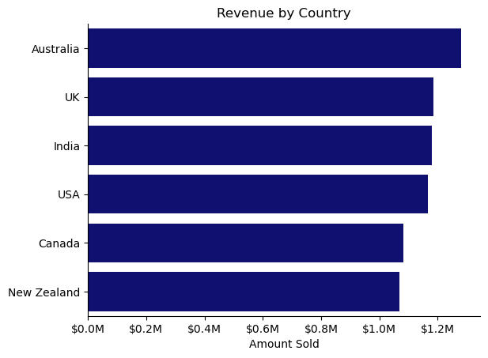
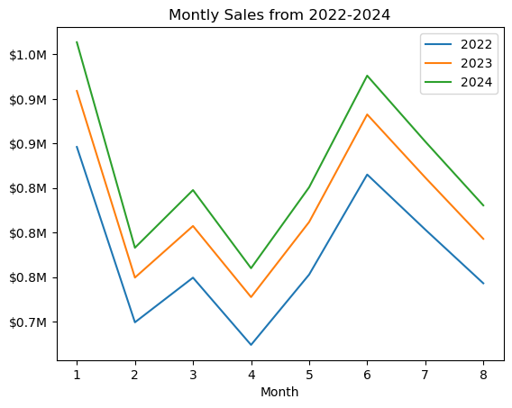
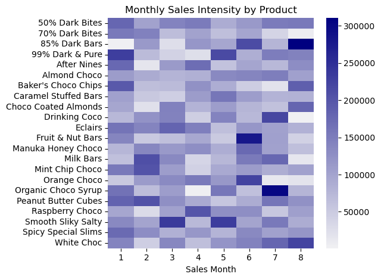
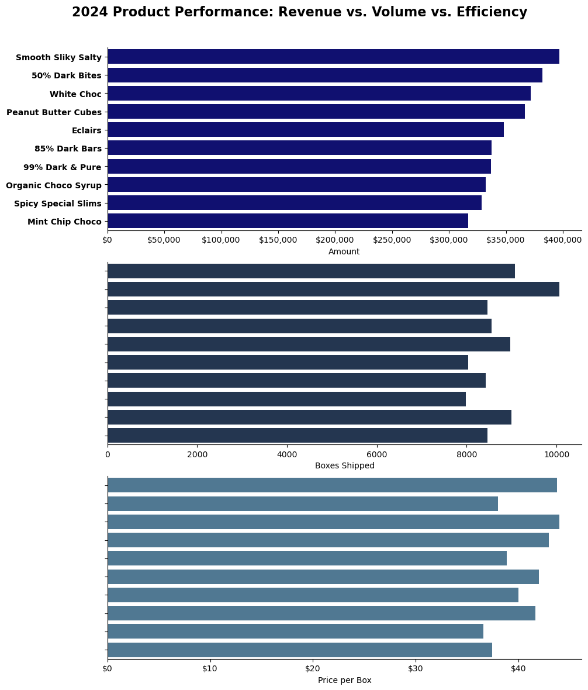
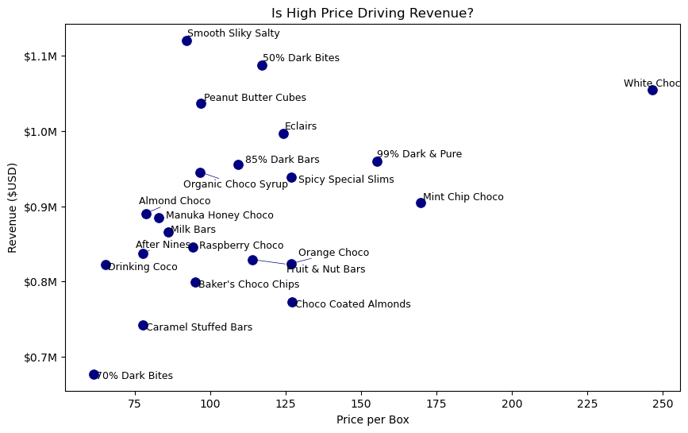
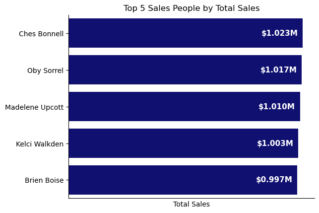

# Chocolate Sales Performance Analysis
 ## My Goal
 Visualizing 3 years of global chocolate sales to find seasonal trends, product efficiency, and high sales performers from the sales team. 

 ## Tools Used
 * Jupityer Notebooks: all python code for data analysis and ETL was written here
 * Python: libraries used matplotlib, seaborn, pandas, sqlalchemy, and adjustText
 * SQL: row validation
 
 ## Analysis
 ### Revenue by Country
 I started analysis with a high level overview identifying the countries where the most sales happen over the 3 year period, and I found Australia to be doing the most followed closely by UK, India, and the USA. All countries included crossed over the 1 million ($USD) threshold.
#### Visualize Data
```python
df_top_country_plot = df_top_country.sort_values(by='Amount', ascending=False).head(10)
sns.barplot(data=df_top_country_plot, x='Amount', y='Country', color='navy')
```
 
 ### Monthly/Yearly Trends
 Monthly sales trends for the 3 years were analyzed, and we can see that we have the same spikes and valleys for all three years ( practice data only includes January-August). This seemed unlikely so I dug deeper using a product heatmap and gained valuable insight into the product trends over the same period. 

#### Visualize Data
```python
for year, data in plots.items():
    data.plot(label=str(year))
```

```python
sns.heatmap(product_pivot, cmap=sns.light_palette("navy", as_cmap=True))
```


### Product Breakdown for 2024
For our most recent year (2024), I went ahead and broke down the top 10 products by revenue and analyzed against the volume/efficiency to identify if our top sellers are due to the quantity of boxes shipped or just the boxes themselves being more expensive. Also I designed a scatter plot to further breakdown the revenue vs price per box for all the products in our data set. 

#### Visualize Data
```python
sns.barplot(data=df_plot, x='Amount', y='Product', ax=ax[0], color='navy')
sns.barplot(data=df_plot, x='Boxes Shipped', y='Product', ax=ax[1], color='#1d3557')
sns.barplot(data=df_plot, x='price_per_box', y='Product', ax=ax[2], color='#457b9d')
```


```python
sns.scatterplot(data=df_product_stats, x='price_per_box', y='Amount', s=100, color='navy')
```


### Top Performers from Sales Team

Lastly, since we had the sales team included in our data set I wanted to look at the top 5 performers over the 3 years of data. From the graphic I was able to build it's obvious that it was a close race. In the future I could get further insights by breaking down what our top performers are actually selling to top the leaderboards. 
#### Visualize Data
```python
df_sales_person_plot = df_sales_person.sort_values(by='total_sold', ascending=False).head(5)
sns.barplot(data=df_sales_person_plot, x='total_sold', y='Sales Person', color='navy')
```


## Insights and Conclusion
While Australia leads the pack, the fact that all regions exceeded $1M in revenue suggests a highly balanced global presence. There isn't a "failing" market, which allows for a strategy of scaling what works in Australia across the UK and US.

The identical "spikes and valleys" across three years, while indicative of practice data, allows for high-precision inventory planning. The business can confidently ramp up production 30 days prior to these known peaks to optimize supply chain costs.

Volume vs. Value: The product efficiency analysis revealed that top revenue isn't always tied to high volume. By identifying products with high price-per-box but lower shipping frequency, we find our high-margin luxury items.

The close race among top performers suggests a healthy, competitive sales culture. The next will identify if top performers are specialists in high-margin items or volume-shifters in emerging markets.