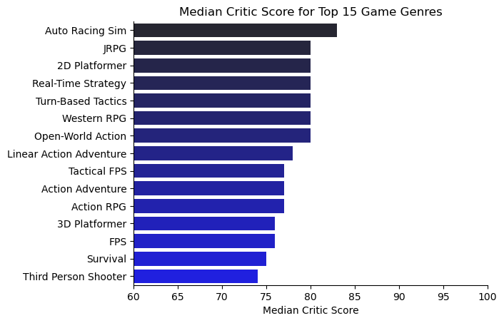
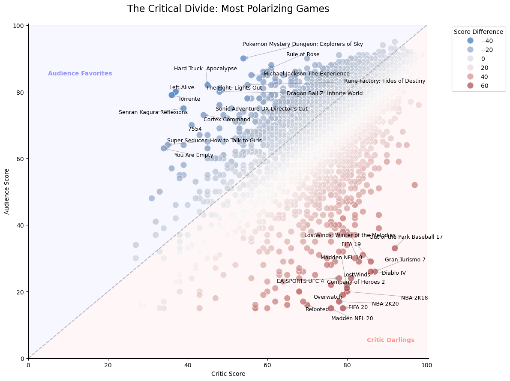
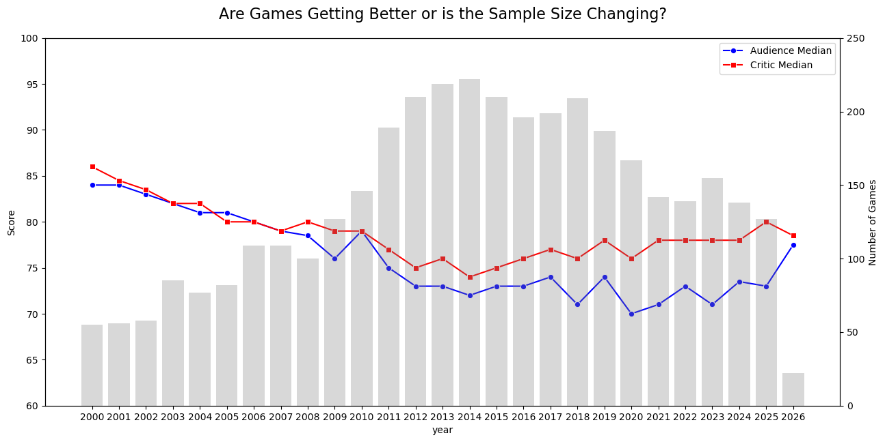
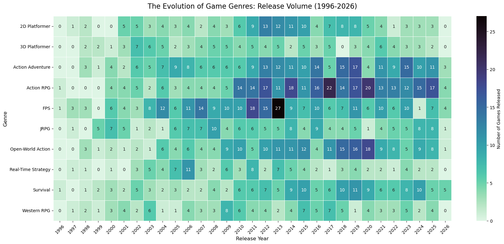
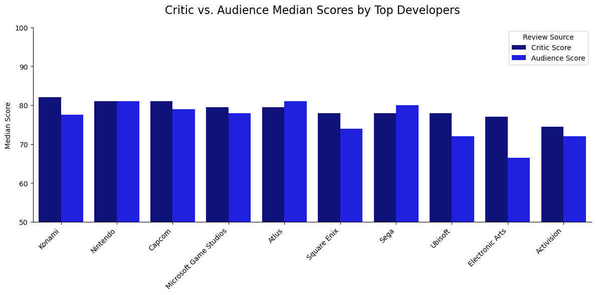
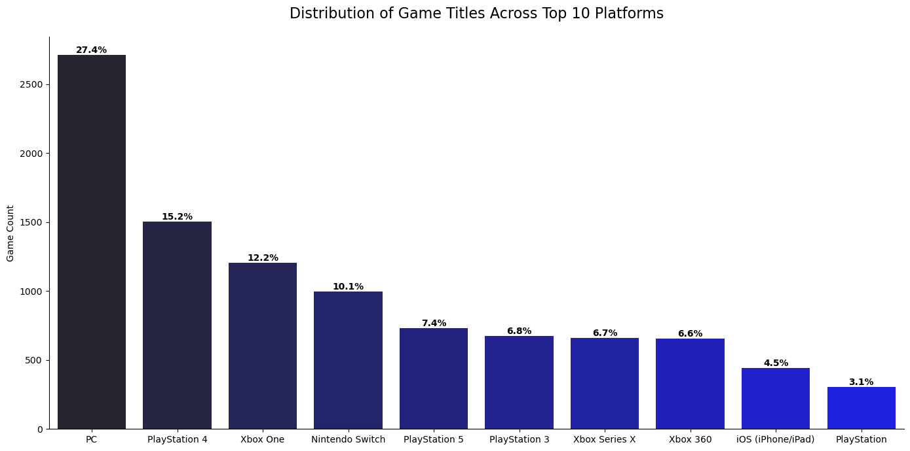
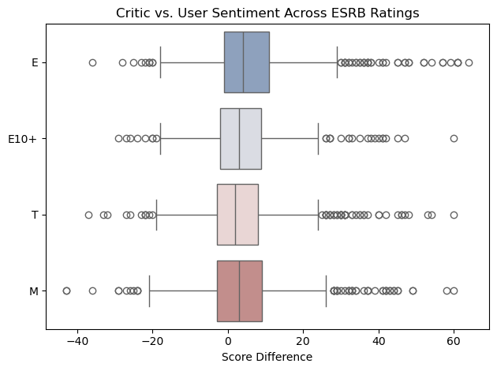

# Metacritic Game Analysis/Scrape
 ## My Goal
 The objective of this project was to scrape Metacritic for game data to analyze trends in sentiment, releases, and genres over more than 25 years. By collecting data on over 4,000 titles, I aimed to visualize the relationship between critic and audience scores and identify the most polarizing game releases in the industry.

 ## Tools Used
 * Jupityer Notebooks: all python code for data analysis and ETL was written here
 * Python: libraries used: matplotlib, seaborn, pandas, numpy, adjustText, requests, and BeautifulSoup
 
 
 ## Analysis
 ### Metacritic Scrape for Game Data
While I have completed several Python projects using existing datasets, I wanted to collect the data myself for this analysis. I used BeautifulSoup to extract the title, release year, audience score, critic score, genre, developer, platform, and ESRB rating.

Because the data was spread across various sections of the website, I implemented multiple loops to cycle through the pages. I performed inner joins on the game titles to ensure a complete dataset without missing values, as the comparison between critic and audience sentiment was a core motivation for this study. To save time, I exported the final 4,000+ rows to a CSV file for use in a separate analysis notebook.

 [View My Complete Scrape Script Notebook Here](scrape/scrape.ipynb) 

 ### Median Metacritic Score for top 15 Genres
I began with a high-level overview of critic sentiment across the top 15 genres by game count. Sim Racing led the pack, followed closely by several genres with a median score of 80. Initially, I filtered by the highest scores, but this led to false conclusions because some genres only had a few games. To fix this, I limited the analysis to genres with at least 70 titles to ensure statistical relevance.
#### Visualize Data
```python
sns.barplot(df_genre_sort, x='median_score', y ='genre', hue = 'genre', palette='dark:b', legend=False)
```
 
 ### Critical Divide: The Most Polarizing Games
Since the dataset included both critic and audience scores, I wanted to highlight the games with the largest score differences. The data shows that critics generally rate games higher than audiences do. Due to the challenge of overlapping labels in the scatterplot, I limited this specific visualization to the top 15 most polarizing titles.

#### Visualize Data
```python
sns.scatterplot(
    data=df_score_comparison, 
    x='score', y='audience_score_x10', 
    hue='score_diff', palette='vlag', 
    s=120, alpha=0.7, edgecolor='w'
)
```


### Critic Vs Audience Sentiment Trend 
I was curious if game quality has improved over time or if sample sizes have shifted. At first glance, scores appeared to peak in the year 2000 and trend downward until a slight recovery began in 2015. This is likely because older games on Metacritic are often the "best" titles that were logged years after their release, whereas modern data includes a wider variety of average titles.
#### Visualize Data
```python
sns.lineplot(data=line_plot, x='year', y='avg_audience_score', ax=ax1, label='Audience Median', color='blue', marker='o')
sns.lineplot(data=line_plot, x='year', y='avg_critic_score', ax=ax1, label='Critic Median', color='red', marker='s')
```



### Game Genre Release Trend from 1996-Present
The heatmap of genre trends is one of my favorite visualizations. It shows that First-Person Shooters (FPS) dominated for over a decade starting in 2003. However, they have since been overtaken by Action RPGs and Open World titles. This shift likely reflects advancements in hardware, as modern consoles and PCs allow developers more creative freedom to build expansive worlds that were not possible in the early 2000s.
 
#### Visualize Data
```python
sns.heatmap(
    genre_stacked, 
    annot=True,              
    fmt='g',                
    cmap='mako_r',             
    linewidths=.5,          
    cbar_kws={'label': 'Number of Games Released'}
)
```


### Critic Vs Audience Sentiment for Top Developers 
I analyzed the median scores for the top 10 developers by title count. Konami led the group with scores in the low 80s, which is consistent with their long-running successful franchises. Nintendo and Capcom also performed well. Interestingly, Nintendo was the only developer to have identical median scores for both critics and audiences, while Sega was the only developer whose audience scores consistently outpaced critic scores.

#### Visualize Data
```python
sns.barplot(data=dev_melted, x='dev', y='Score Value', hue='Score Type', 
            palette={'critic_median': 'darkblue', 'audience_median': 'blue'})

```


### Distribution of Game Titles Across the Top 10 Platforms
PC dominance was expected given the sheer volume of indie titles and the fact that most AAA games eventually release on the platform. One of the main technical challenges here was cleaning the "blob of text" platform lists into a format that could be exploded and counted correctly. I expect the PlayStation 5 to rise significantly in these rankings over the next few years.
#### Visualize Data
```python
ax=sns.barplot(df_platform_plot, x='platform_list', y ='platform_count', hue='platform_list', palette='dark:b')
```


### Critic Vs Audience Sentiment for ESRB Ratings
Finally, I examined how scores differ across ESRB ratings. Critics generally score higher across all categories. However, the Mature (M) category showed the widest spread of scores. This suggests that Mature-rated games are the most polarizing, likely due to risky narrative choices or technical ambitions that divide fans and professionals.

#### Visualize Data
```python
rating_order = ['E', 'E10+', 'T', 'M']
sns.boxplot(df_rating, x='score_dif', y = 'rating', order = rating_order, palette='vlag')
```


## Insights and Conclusion
The "Golden Age" is a Data Illusion:
Older games in Metacritic are primarily "the greats" that were worth archiving years later. As my dataset grows toward 2026, it captures the "middle class" of gaming—average titles that pull the median score down, creating a more realistic (but lower) industry average.

The Professional vs. Personal Divide:
My analysis confirms a systematic gap between how critics and fans evaluate products. Professional reviewers rarely drop below a 60 for functional AAA games, creating a safer, tighter scoring distribution. Though fans are far more likely to use the extremes (0 or 100), especially in the Mature (M) category, which showed the highest polarization due to risky narrative or technical choices.

Genre Evolution: From Loops to Worlds
The heatmap reveals a fundamental shift in game design driven by hardware capabilities.
The FPS Era (2003–2013) when technical constraints limited scope. The Open-World Pivot (2015–2026). As RAM and processing power increased, "Action RPG" and "Open World" became the dominant genres, trading linear intensity for immersion.

Brand Trust and Outliers:
Developer medians highlight the rare instances where expectations meet reality. Nintendo stands alone with a near-perfect 1:1 ratio between critic and audience sentiment, suggesting the highest level of predictable quality. 
Sega was the only major outlier where fans consistently rated games higher than critics, indicating a "soul" or nostalgia factor that professional rubrics might overlook.

Platform Dominance:
PC remains the baseline for the dataset due to its role as the primary home for both indie titles and late-lifecycle AAA ports. While older platforms hold the volume now, the PS5 shows the steepest trajectory for future growth in my dataset.

[View My Complete Jupyiter Notebook Here](analysis/analysis.ipynb)