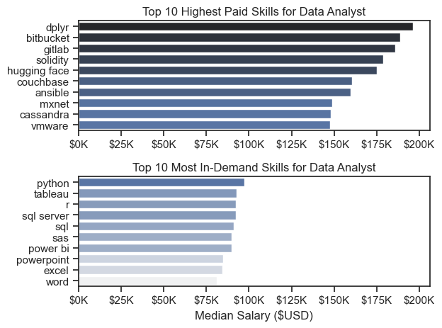

# My Python Projects Portfolio

Welcome! This repository serves as a showcase of all my python projects. Below you will find links to each one of my projects and specific information about each. 

## Featured Python Projects
 
### 1\. Youtube Python Course Final Project

This project was created out of a desire to navigate and understand the job market more effectively. It delves into the top-paying and in-demand skills to help find optimal job opportunities.

### Tools Used
* Python: the backbone of my analysis. Libaries used (matplotlib, pandas, and seaborn)

* Juypter Notebooks: the tool I used to run my python scripts. 

* Visual Studio Code: My go-to for executing python scripts

* Git and GitHub: Version control and sharing my python code and analysis.

[View the Full Project Here](Final_Project\README.md)

### 💡 Credits & Acknowledgements

The data and tutorial followed for this project was provided by [Luke Barousse's Python For Data Analytics Course](https://www.youtube.com/watch?v=wUSDVGivd-8&t=39548s).

### 2\. Chocolate Sales Analysis

Strategic Focus: Visualizing 3 years of global chocolate sales to find seasonal trends, product efficiency, and high sales performers from the sales team. 

### Tools Used
* Python: libraries used matplotlib, seaborn, pandas, sqlalchemy, and adjustText

* SQL: ETL/Row Validation

* Juypter Notebooks: the tool I used to run my python scripts. 

* Visual Studio Code: My go-to for executing python scripts

* Git and GitHub: Version control and sharing my python code and analysis.

[View the Full Project Here](Chocolate_Sales/README.md)

### 3\. Metacritic Game Analysis

Strategic Focus: The objective of this project was to scrape Metacritic for game data to analyze trends in sentiment, releases, and genres over more than 25 years. By collecting data on over 4,000 titles, I aimed to visualize the relationship between critic and audience scores and identify the most polarizing game releases in the industry. 

This has been my most ambitious python project to date as all the data was scraped and collected by me rather than using an existing dataset. 

### Tools Used
* Python: libraries used: matplotlib, seaborn, pandas, numpy, adjustText, requests, and BeautifulSoup

* Juypter Notebooks: the tool I used to run my python scripts. 

* Visual Studio Code: My go-to for executing python scripts

* Git and GitHub: Version control and sharing my python code and analysis.

[View the Full Project Here](Metacritic_Analysis/README.md)

